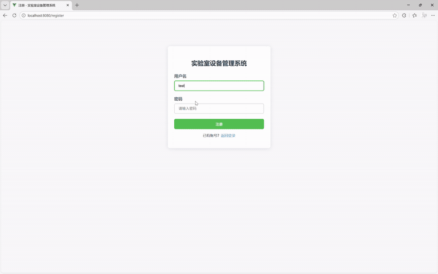
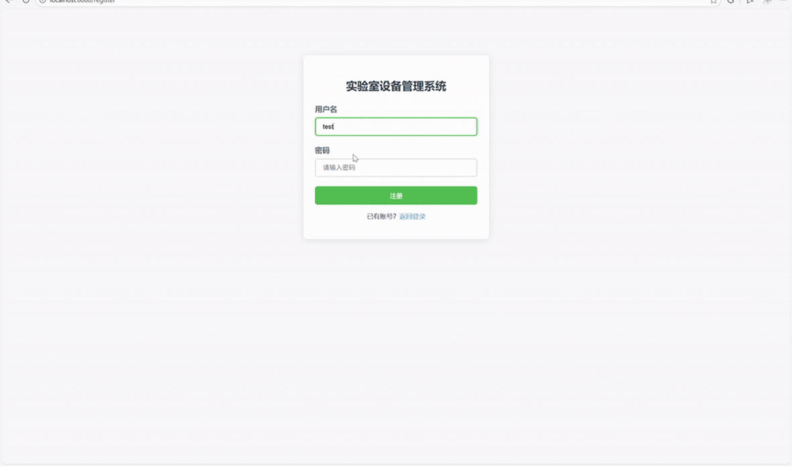
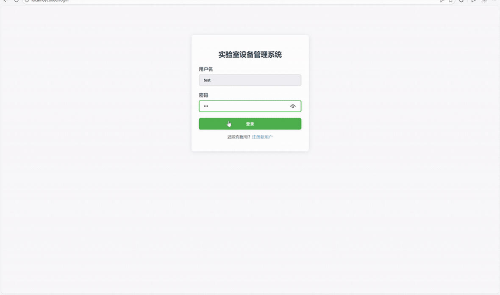
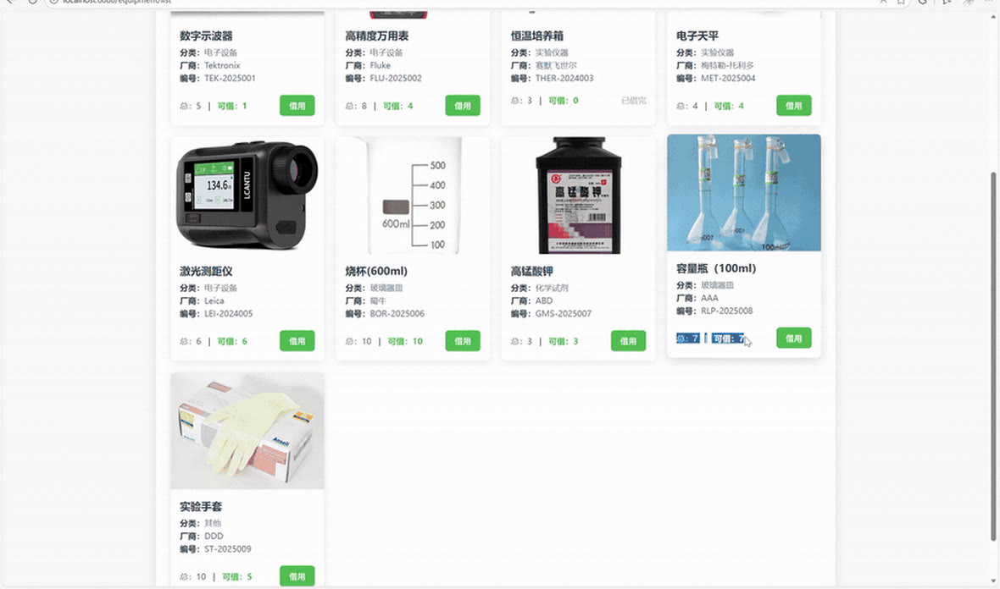
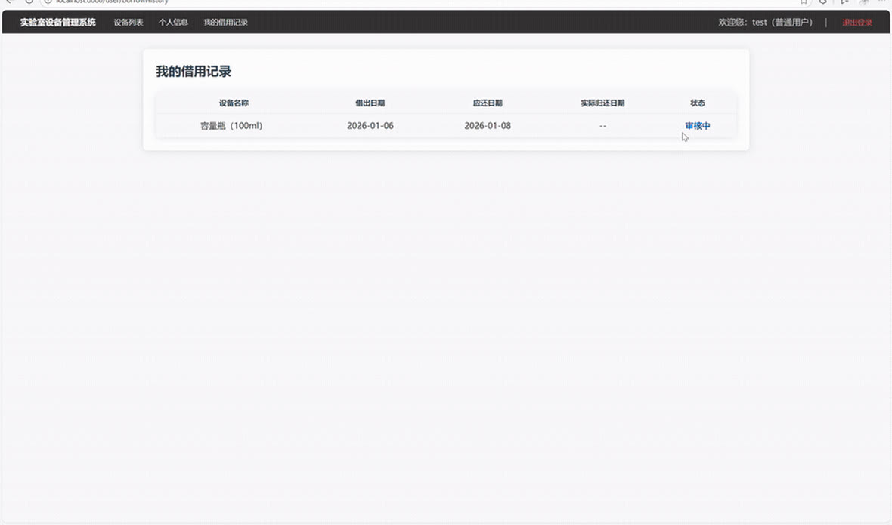
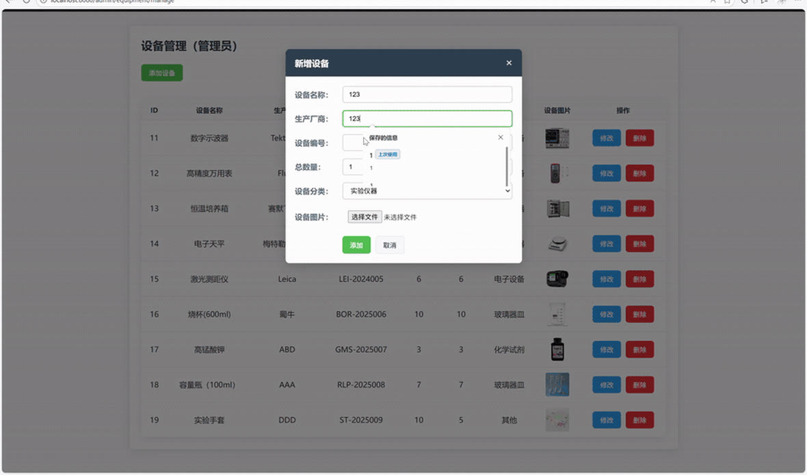
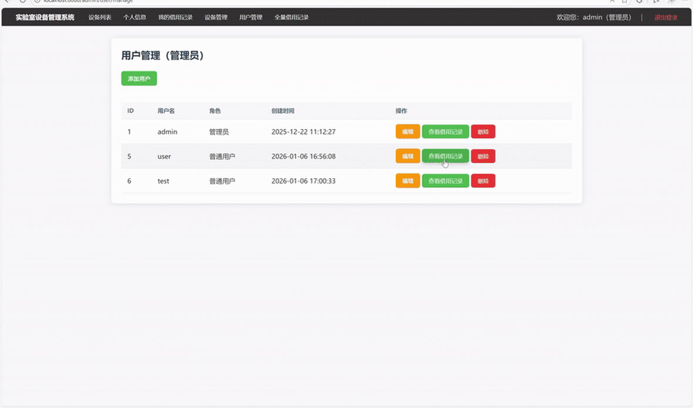
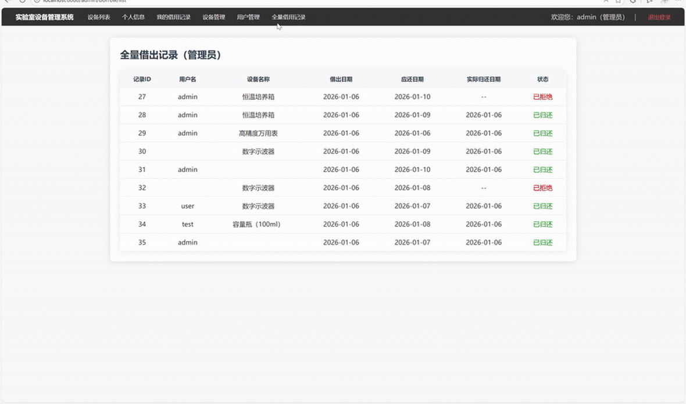
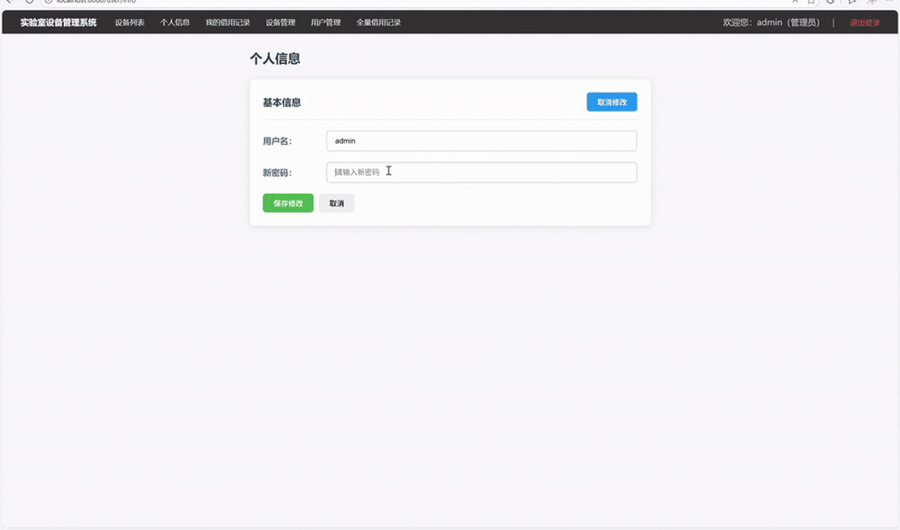

# 实验室设备管理系统（SSM）

基于 Spring + Spring MVC + MyBatis 的实验室设备借还管理系统。用户在线浏览设备并发起借出申请，管理员审批借还与维护设备、用户。

## 演示



完整演示视频（约 4 分钟，含各角色完整操作流程）：[docs/demo-full.mp4](docs/demo-full.mp4)

### 界面截图

| 登录 | 注册 | 设备列表 | 我的借用记录 |
| :---: | :---: | :---: | :---: |
|  |  |  |  |
| **设备管理（管理员）** | **用户管理（管理员）** | **全部借出记录** | **个人资料** |
|  |  |  |  |

> 截图为项目实际运行画面。

## 技术栈

| 层次 | 技术选型 |
| --- | --- |
| 容器与框架 | Spring 5、Spring MVC（全部使用 Java 配置类，无 XML 装配） |
| 持久层 | MyBatis（Mapper 接口 + 注解 SQL）、Druid 连接池 |
| 数据库 | MySQL 8 |
| 视图层 | JSP + JSTL（服务端渲染） |
| 构建部署 | Maven 打包为 war，部署到 Tomcat |

## 功能

### 普通用户

- 注册与登录
- 按分类与关键字浏览设备，查看厂商、编号、库存与可借数量
- 发起借出申请，填写借出日期与应还日期
- 查看个人借用记录及审批状态
- 维护个人资料

### 管理员

- 设备管理：新增、编辑、删除设备，维护库存与设备图片
- 用户管理：查看用户列表
- 借用审批：批准或驳回用户的借出申请

服务端共 5 个控制器、25 个请求映射；数据访问层有 3 个 Mapper、20 条注解 SQL。

## 项目结构

```
├── src/main/java/com/lab/
│   ├── config/        Spring、Spring MVC、Web 三层 Java 配置类
│   ├── controller/    控制器：首页、用户、设备、借用、管理端
│   ├── service/       业务接口与实现（含 impl 子包）
│   ├── mapper/        MyBatis Mapper 接口（注解 SQL）
│   ├── entity/        实体类：User / Equipment / Borrow
│   └── util/          统一返回结果、Web 工具类
├── src/main/resources/
│   ├── jdbc.properties.example   数据库连接配置模板
│   └── log4j.properties          日志配置
├── src/main/webapp/
│   ├── WEB-INF/jsp/              页面：login / register / index / equipment / user / admin
│   ├── WEB-INF/web.xml           Servlet 容器入口
│   └── static/                   样式、脚本与设备图片
├── docs/                         演示动图、完整视频与界面截图
└── equipment_ssm.sql             数据库结构与初始数据
```

## 本地运行

### 1. 导入数据库

```bash
mysql -u root -p -e "CREATE DATABASE equipment_ssm DEFAULT CHARSET utf8mb4"
mysql -u root -p equipment_ssm < equipment_ssm.sql
```

### 2. 配置数据库连接

`jdbc.properties` 含本机数据库密码，未纳入版本管理：

```bash
cp src/main/resources/jdbc.properties.example src/main/resources/jdbc.properties
```

然后编辑 `jdbc.properties`，填入自己的数据库地址、账号与密码。

### 3. 打包

```bash
mvn clean package
# 产物：target/lab-equipment-system-1.0-SNAPSHOT.war
```

### 4. 部署运行

把 war 放进 Tomcat 8/9 的 `webapps` 目录（或在 IDEA 中配置 Tomcat 运行），启动后访问：

```
http://localhost:8080/lab-equipment-system-1.0-SNAPSHOT/
```

## 测试账号

| 账号 | 密码 | 角色 |
| --- | --- | --- |
| `admin` | `123456789` | 管理员 |
| `user123` | `123456` | 普通用户 |
| `test` | `123456` | 普通用户 |

> `src/` 目录下另有一份导出副本，其中 admin 密码为 `123456`，两份任选其一导入即可。

## 说明

- 密码在数据库中以 MD5 存储，仅用于课程演示，未做加盐处理。
- `jdbc.properties` 因包含本机数据库密码而未纳入版本管理，请按示例文件自行创建。

